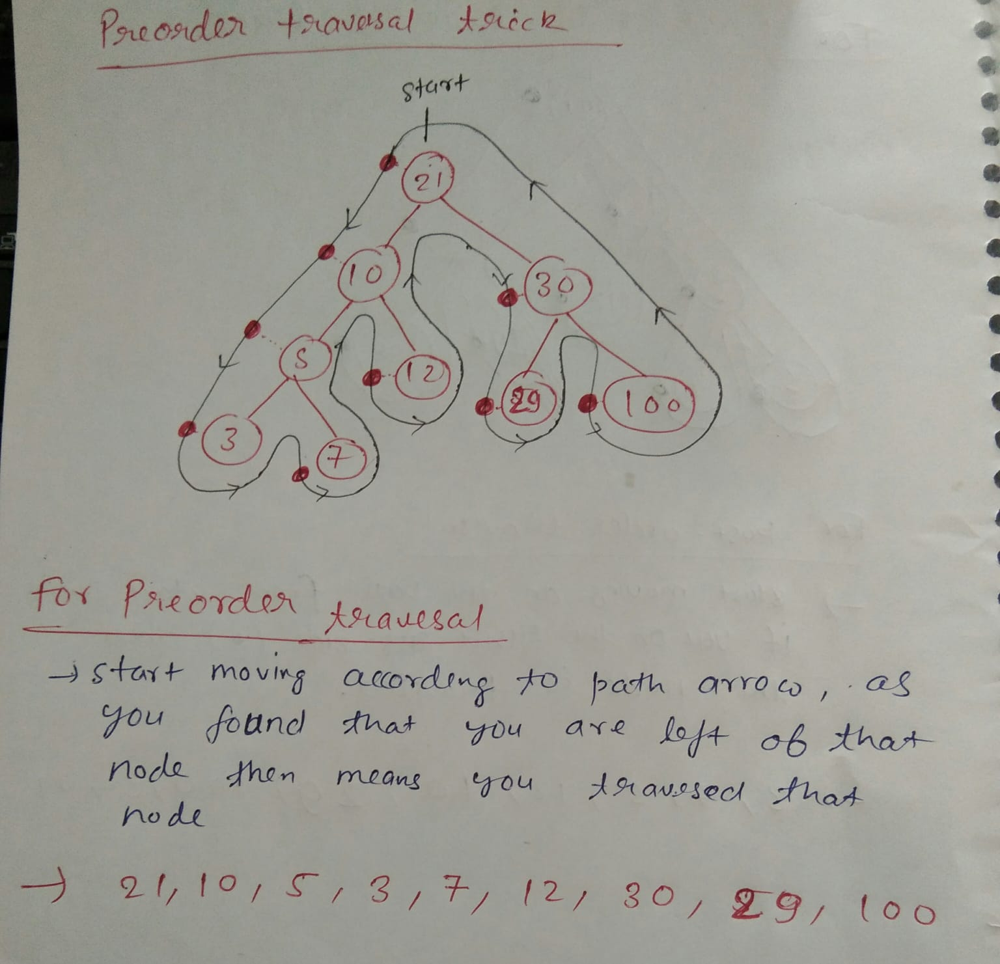
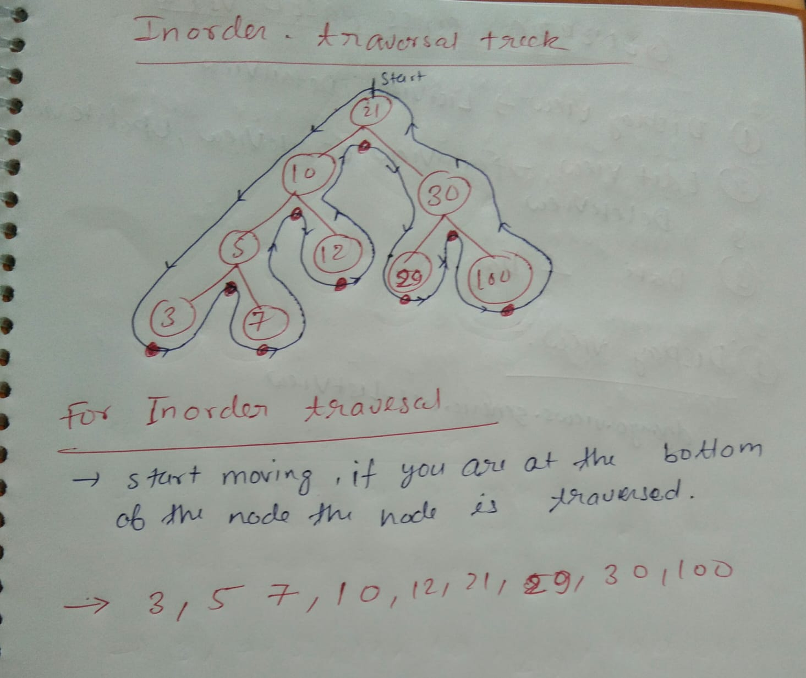
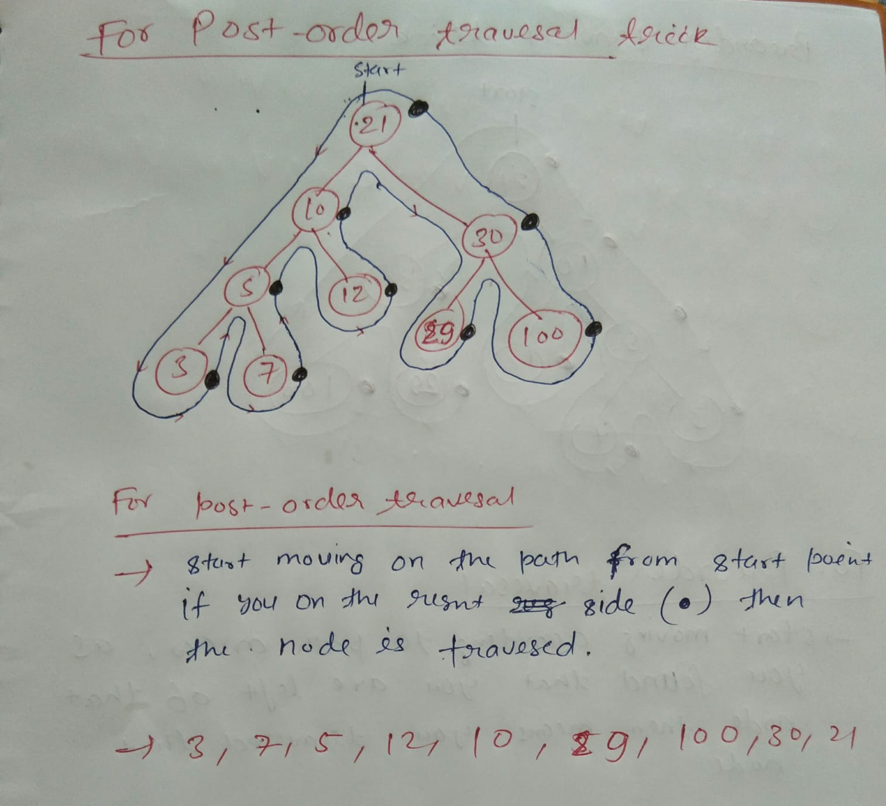

# Traversal In Tree

## 1. Pre-order Travesal

### Root Left Right

    1. Visit the root node
    2. Traversing the left sub-tree and finaly
    3. Traversing the right sub-tree
    (repeat these step recursively)

## 2. In-order Travesal

### Left Root Right

    1. Traverse the lelft sub-tree
    2. Visit the root node and finally
    3. Traversing the right sub-tree
    (repeat these step recursively)

## 3.Post-order Travesal

### Left Right Root

    1. Traversing the left subtree
    2. Traversing the right sub-tree and finaly
    3. Visit the root node
    (repeat these step recursively)

# Deletion of node

## 1. When there is no child is present

    1. Simply delete the node with zero child.
    2. And point the parent node to None.

## 2. When there is only one child is present

    1. Simply delete the node with one child.
    2. And now replace with the child node with node you want to delete.

## 3. When there is two child present

    1. Find the smallest node from the right subtree.
    2. And then replace the node with the smallest node from right subtree.
z
